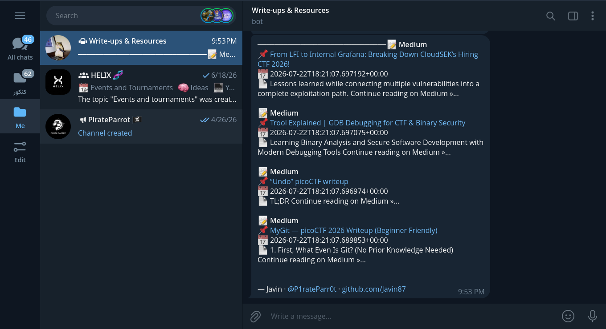
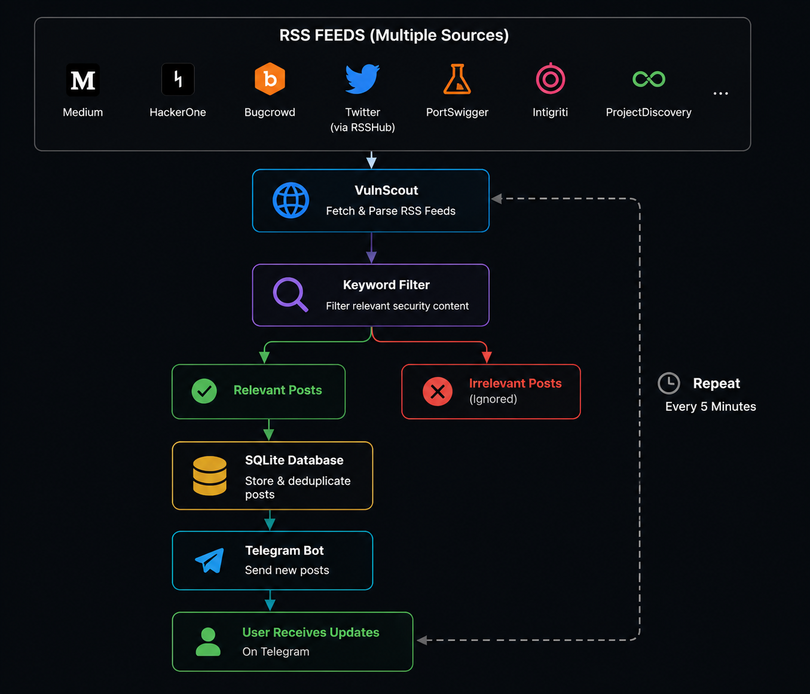

# 🛡️ VulnScout

> Lightweight Vulnerability Intelligence Aggregator for Security Researchers

Monitor multiple security sources, filter relevant vulnerability research, eliminate duplicates, and receive real-time Telegram notifications.

[](https://python.org)
[](LICENSE)
[]()
[]()
[]()
[]()

---

## 🎬 Demo

<p align="center">
  
</p>
<p align="center">
  
</p>

---

## 📸 Screenshots

<p align="center">
  
</p>

---

## ✨ Features

- 📡 Monitor multiple cybersecurity RSS feeds simultaneously.
- 🔎 Filter posts using customizable security keywords.
- 💾 Store discovered posts in SQLite to prevent duplicates.
- 📨 Receive instant Telegram notifications for new content.
- 🌐 HTTP and SOCKS proxy support.
- 🔁 Automatic retry mechanism for failed requests.
- 🧹 HTML summary cleaning using BeautifulSoup.
- ⏱️ Configurable polling interval.
- ⚙️ Easily add or remove RSS sources.
- 🐍 Lightweight, dependency-free architecture (SQLite + Python).
- 🐧 Designed for Linux servers and VPS deployments.
- 🔓 Fully open source and customizable.

---

## 🏗️ Architecture

<p align="center">
  
</p>

---

# Why I Built VulnScout

As someone who spends a significant amount of time in the cybersecurity world, I realized that finding high-quality vulnerability research had become more difficult than actually reading it.

Every day, valuable content is published across dozens of different platforms. A new HackerOne disclosure appears here, an Intigriti write-up is posted there, someone publishes an excellent Medium article, PortSwigger releases new research, and ProjectDiscovery shares another technical blog post. Keeping up with all of these sources meant opening countless tabs, checking RSS feeds manually, scrolling through X (Twitter), and hoping I hadn't missed something important.

The result was always the same: I missed interesting write-ups, discovered vulnerability disclosures days after they were published, and wasted far too much time searching instead of learning.

I wanted a tool that could do the monitoring for me.

That idea became **VulnScout**.

VulnScout is a lightweight vulnerability intelligence aggregator that continuously monitors multiple trusted security sources, filters the content using security-related keywords, stores previously discovered posts to prevent duplicates, and instantly delivers new findings to Telegram.

Instead of visiting ten different websites every day, I now receive a curated stream of vulnerability disclosures, bug bounty write-ups, penetration testing articles, and security research directly in one place.

The project was intentionally designed to remain simple:

- No cloud infrastructure.
- No complicated databases.
- No external services other than the RSS sources and Telegram.
- Just Python, SQLite, and a few well-tested libraries.

Whether you're a penetration tester, bug bounty hunter, CTF player, security researcher, or simply someone who enjoys staying up-to-date with the latest offensive security techniques, VulnScout helps reduce the noise and lets you focus on what actually matters: learning from newly published security research.

This project is open source because I believe security knowledge should be easier to discover—not harder.

## ⚙️ How It Works

VulnScout follows a simple pipeline to discover and deliver new cybersecurity content.

1. **Fetch RSS Feeds**

   * Retrieves all configured RSS feeds from multiple security platforms such as Medium, HackerOne, Bugcrowd, PortSwigger, Intigriti, and more.

2. **Parse Feed Entries**

   * Extracts the title, URL, publication date, and summary from each feed item.

3. **Filter Relevant Content**

   * Compares each post against a configurable list of security-related keywords.
   * Irrelevant posts are skipped immediately.

4. **Remove Duplicates**

   * Checks whether the post has already been processed.
   * Previously discovered URLs are ignored automatically.

5. **Store New Posts**

   * Saves unique posts into a local SQLite database for future reference.

6. **Generate Telegram Message**

   * Formats the post into a clean, readable Telegram message containing the title, source, publication date, summary, and direct link.

7. **Send Notification**

   * Delivers the message instantly to your Telegram chat using the Bot API.

8. **Repeat**

   * Sleeps for the configured interval and starts the process again, continuously monitoring all configured sources.

## 📋 Prerequisites

Before installing VulnScout, make sure your system meets the following requirements:

* Python **3.10** or newer
* Git
* Internet connection
* A Telegram account
* A Telegram Bot (created via BotFather)
* A Telegram Chat ID
* Linux (recommended)

> VulnScout has been primarily developed and tested on Linux. It should also work on Windows and macOS with minor adjustments.

---

## 🚀 Installation

### 1. Clone the Repository

```bash
git clone https://github.com/javin87/VulnScout.git
cd VulnScout
```

### 2. Create a Virtual Environment

```bash
python3 -m venv .venv
```

Activate it:

**Linux/macOS**

```bash
source .venv/bin/activate
```

**Windows**

```powershell
.venv\Scripts\activate
```

### 3. Install Dependencies

```bash
pip install -r requirements.txt
```

### 4. Create the Environment File

```bash
cp .env.example .env
```

You will configure the `.env` file in the next section.

---

After completing these steps, you're ready to create your Telegram bot and configure VulnScout.

## 🤖 Creating a Telegram Bot

VulnScout sends notifications through the Telegram Bot API. Before running the application, you'll need to create your own Telegram bot.

### Step 1 — Open BotFather

Open Telegram and search for **@BotFather**, or visit:

https://t.me/BotFather

BotFather is the official Telegram bot used to create and manage bots.

---

### Step 2 — Create a New Bot

Start a conversation with BotFather and send:

```text
/newbot
```

BotFather will ask for:

1. A display name

Example:

```text
VulnScout
```

2. A unique username that ends with `bot`

Example:

```text
vuln_scout_bot
```

If the username is available, BotFather will create your bot successfully.

---

### Step 3 — Save Your Bot Token

After creating the bot, BotFather will send you an HTTP API token that looks similar to this:

```text
1234567890:AAExampleBotTokenXXXXXXXXXXXXXXXXXX
```

Keep this token safe.

Anyone with access to this token can control your bot.

You'll use this token later inside the `.env` file.

## 🆔 Getting Your Telegram Chat ID

VulnScout needs your Telegram Chat ID to know where notifications should be delivered.

There are multiple ways to obtain your Chat ID.

---

### Method 1 — Using @userinfobot (Recommended)

This is the easiest method.

1. Open Telegram.
2. Search for **@userinfobot**.
3. Start the bot.
4. Send any message.

The bot will immediately reply with information similar to:

```text
Id: 123456789
First Name: John
Username: johndoe
```

Your **Id** is your Chat ID.

---

### Method 2 — Using the Telegram Bot API

First, send any message to the bot you created.

For example:

```text
Hello
```

Then open the following URL in your browser (replace `<BOT_TOKEN>` with your own token):

```text
https://api.telegram.org/bot<BOT_TOKEN>/getUpdates
```

Example:

```text
https://api.telegram.org/bot123456:ABCDEF123456789/getUpdates
```

If successful, you'll receive a JSON response similar to:

```json
{
  "ok": true,
  "result": [
    {
      "message": {
        "chat": {
          "id": 123456789,
          "type": "private"
        }
      }
    }
  ]
}
```

The value of `"id"` inside `"chat"` is your Chat ID.

> **Important:** If the `result` array is empty, make sure you've sent at least one message to your bot before calling `getUpdates`.

---

### Method 3 — Using a Group

If you want VulnScout to send notifications to a Telegram group:

1. Add your bot to the group.
2. Send at least one message in the group.
3. Call `getUpdates` again.

The Chat ID will usually be a negative number, for example:

```text
-1001234567890
```

Copy the entire number, including the minus sign.

---

Once you've obtained your Chat ID, you'll use it together with your Bot Token in the `.env` file.

## ⚙️ Configuring the `.env` File

VulnScout uses environment variables to keep sensitive information and runtime configuration separate from the source code.

Create a file named `.env` in the project's root directory.

Example:

```env
# Telegram
TELEGRAM_BOT_TOKEN=1234567890:AAExampleBotTokenXXXXXXXXXXXXXXXXXX
TELEGRAM_CHAT_ID=123456789

# Optional HTTP/SOCKS Proxy
PROXY=http://127.0.0.1:2080

# Optional RSSHub Instance
RSSHUB_BASE_URL=https://rsshub.app
```

---

### Variable Reference

#### `TELEGRAM_BOT_TOKEN`

The HTTP API token provided by **BotFather**.

Example:

```text
1234567890:AAExampleBotTokenXXXXXXXXXXXXXXXXXX
```

This value is **required**.

---

#### `TELEGRAM_CHAT_ID`

The Telegram chat where VulnScout will send notifications.

Example:

```text
123456789
```

For groups:

```text
-1001234567890
```

This value is **required**.

---

#### `PROXY`

(Optional)

Specify an HTTP or SOCKS proxy if your network cannot access Telegram or RSS feeds directly.

Examples:

```text
http://127.0.0.1:2080
```

```text
socks5://127.0.0.1:1080
```

Leave this variable empty if you don't use a proxy.


---

After saving the `.env` file, VulnScout is fully configured and ready to run.

## 📄 License

This project is licensed under the MIT License.

See the [LICENSE](LICENSE) file for more information.

## 🙏 Acknowledgements

VulnScout wouldn't be possible without the excellent open-source tools and services provided by the community.

Special thanks to:

* Python
* feedparser
* requests
* BeautifulSoup4
* SQLite
* Telegram Bot API
* RSSHub
* HackerOne
* Bugcrowd
* PortSwigger Research
* Intigriti
* ProjectDiscovery
* Medium

Thank you to everyone in the cybersecurity community who shares their research and helps make security knowledge more accessible.

## 🌐 Community

Interested in cybersecurity, bug bounty, CTFs, and offensive security?

Join the **P1rateParr0t** Telegram channel for security news, research, write-ups, and updates about VulnScout.

📲 Telegram: **@P1rateParr0t**

If this project helped you, consider giving it a ⭐ on GitHub.